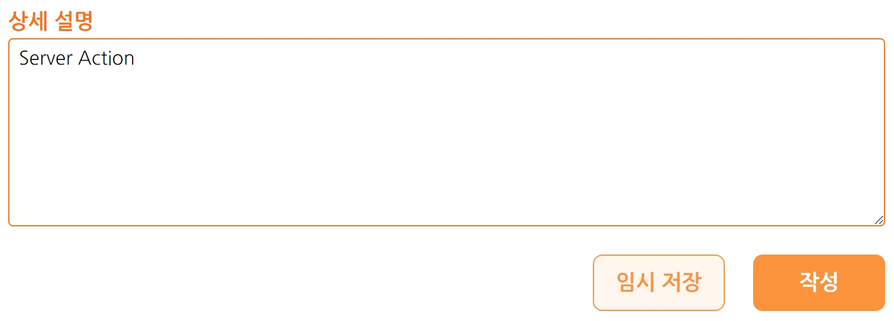
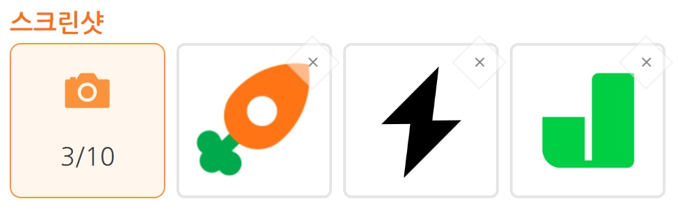
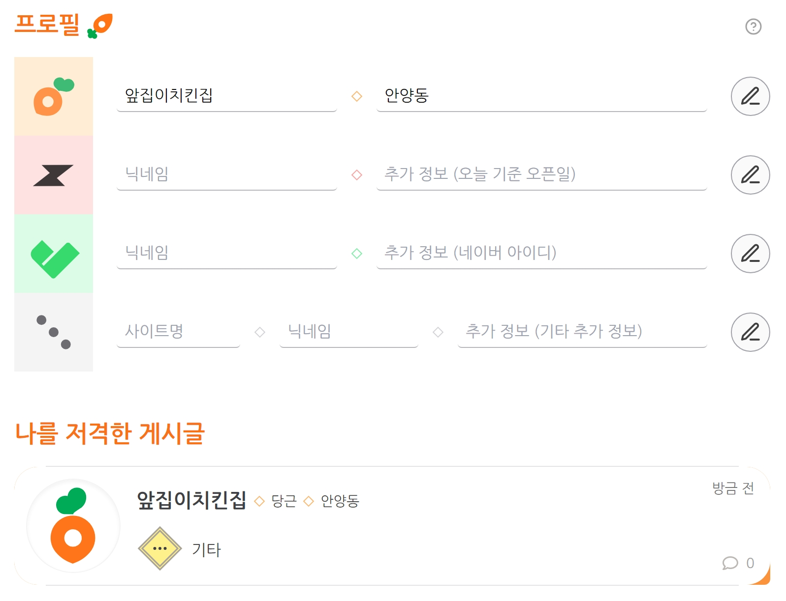
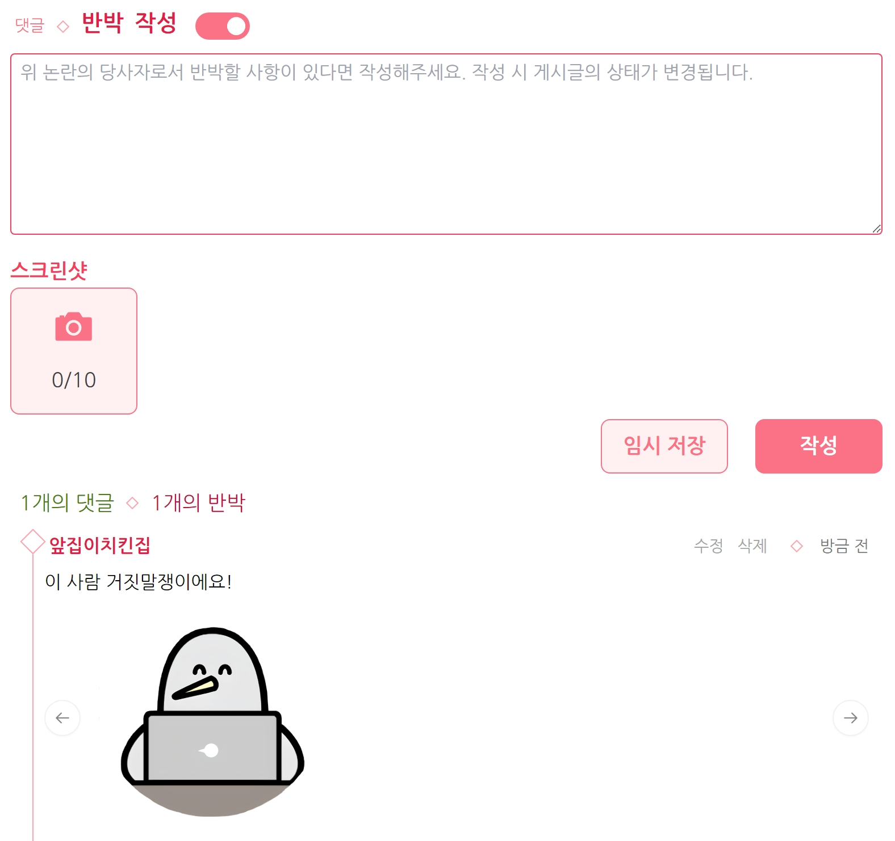
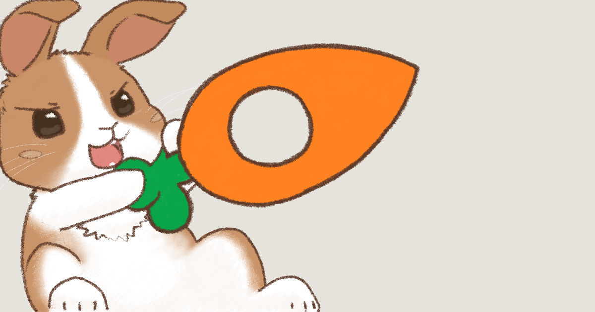
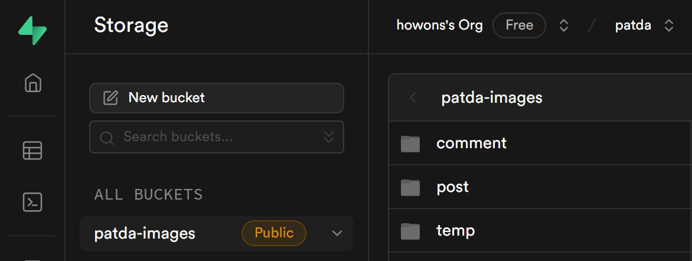

# 당근빳다 

### 중고거래 진상유저 정보 공유 플랫폼

중고거래를 하다보면 반드시 **진상유저**를 만납니다. 상대를 배려하지 않는 그들은 **과도한 요구**를 하거나, **이상한 트집**을 잡거나, **노쇼**를 하면서 일방적으로 **거래를 파기**합니다.

문제는 대부분의 중고거래 플랫폼에서 상대방에 대한 상세 후기는 **거래가 성사**되어야만 작성할 수 있습니다. 다른 유저들에게 진상유저를 경고할 장소가 없어 복수를 참았다면 **당근빳다**를 이용해주세요.

## 기술 스택

## 기능

### 게시글 폼

- 폼 제출에 점진적 향상 조건을 충족시키고 DB와 연결 용이성 및 보안을 위해 **서버액션**을 적용했습니다.
- 인터넷이 느려 **JS가 로딩이 덜 된 상태**에서도 HTML form의 `action` 속성을 통해 서버로 요청을 보내 제출 기능은 사용할 수 있습니다.
- DB를 별도 **API end point없이** 서버 측에서 직접적으로 사용할 수 있어 타입 추론과 소스 이동 등 개발 용이성을 위한 보조기능을 활용할 수 있습니다.
- 서버 액션의 응답을 규격화해 커스텀 훅으로 응답 처리 로직을 **재사용**할 수 있도록 구현했습니다. 커스텀 훅은 `React-Hook-Form`과 `useFormState`를 활용해 에러처리 로직 및 제출 후 폼 초기화 로직을 추상화합니다.
- `useFormStatus`를 통해 버튼에 로딩 상태를 표시합니다.

[코드 - post/create/form.tsx](app/post/create/form.tsx)

[코드 - useFormActoin.ts](app/lib/hooks/useFormAction.ts)

### 이미지 폼

- `React-Hook-Form`의 `useArrayField`를 이용해 복수의 이미지 입력이 가능하도록 구현했습니다.
- "x" 버튼 클릭 시 이미지 리스트에서 제거합니다.
- 이미지 클릭 시 미리보기 모달을 표시합니다.

### 본인 프로필

- 본인의 중고거래 플랫폼별 프로필을 등록할 수 있습니다.
- 등록된 정보를 토대로 나를 저격한 게시글을 자동 검색합니다.

[코드 - profile page](app/profile/page.tsx)

### 댓글/반박

- 작성된 게시글에 대해 댓글이나 반박을 작성할 수 있습니다.
- 반박은 증거 사진을 첨부할 수 있습니다.

[코드 - CommentContainer.tsx](<app/post/[id]/(comment)/CommentContainer.tsx>)

### open graph 이미지

- Next.js의 동적 og-image 생성 기능을 적용해 게시글 링크 시 대상 유저의 닉네임과 플랫폼이 og-image 내 글씨로 나타나도록 구현했습니다.
- 관련 메타데이터도 게시글 별로 나타나도록 구성했습니다.

[코드 - opengraph-image.tsx](app/post/[id]/opengraph-image.tsx)

### DBaaS

- DB 사용이 처음인 점을 고려해 진입장벽이 가장 낮은 **Vercel Postgres** 서비스를 주요 DB로 채택했습니다. SQL은 Kysely ORM을 적용하여 타입 추론 및 자동완성 기능을 활용해 사용 난이도를 낮췄습니다.
- 이미지 저장소는 Vercel Blob이 베타인 점을 고려해 다음으로 진입장벽이 낮은 **Supabase Storage** 서비스를 채택했습니다. 임시저장 기능을 위해 글 작성 중엔 임시 폴더에 이미지를 미리 업로드하고 게시 시점에 관련 폴더로 이동하도록 구현했습니다.
- DB를 초기화하는 스크립트를 별도로 작성하여 개발이 용이하도록 했습니다.

### 스토리북

- 사용자 인터렉션 애니메이션을 적극 활용한 만큼 **인터렉션 테스트**를 시각적으로 보기 위해 스토리북을 작성했습니다. 스토리북 내부적으로 Jest와 Playwright으로 동작하는 Test Runner 모듈을 이용해 테스트를 작성했습니다.
- 폼의 동작도 테스트할 수 있도록 서버액션 내부 DB 함수를 **Mocking Module**로 만들어 처리했습니다. 모듈의 실행 환경별 자동 분기를 위해 Subpath Import를 적용했습니다.

[코드 - 검색바 스토리](stories/Search.stories.tsx)
